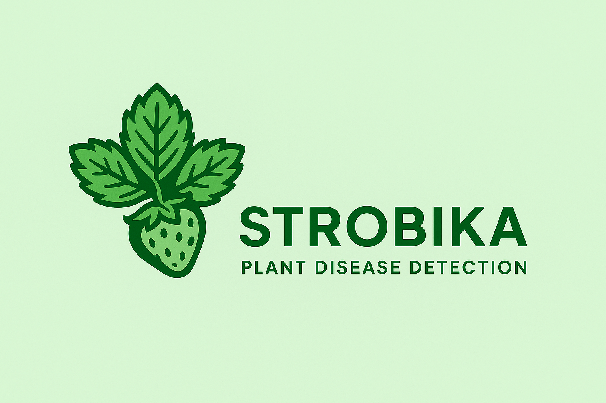

# Strobika - Sistem Deteksi Penyakit Daun Stroberi



## 📝 Deskripsi Proyek

Strobika adalah aplikasi web berbasis AI yang dirancang untuk mendeteksi penyakit pada daun tanaman stroberi. Aplikasi ini menggunakan model YOLOv8 untuk mengidentifikasi berbagai jenis penyakit daun stroberi dengan cepat dan akurat, membantu petani dan penghobi dalam mendiagnosis masalah tanaman stroberi mereka.

## ✨ Fitur Utama

- **Deteksi Penyakit**: Unggah gambar daun stroberi untuk identifikasi penyakit secara instan
- **Deteksi Realtime**: Gunakan webcam untuk deteksi penyakit secara langsung
- **Asisten AI**: Chatbot terintegrasi dengan Gemini API untuk memberikan informasi dan solusi tentang penyakit yang terdeteksi
- **Hasil Terperinci**: Visualisasi hasil deteksi dengan tingkat akurasi dan lokasi penyakit
- **Antarmuka Responsif**: Desain modern yang berfungsi dengan baik di berbagai perangkat

## 🛠️ Teknologi yang Digunakan

- **Backend**: Python, Flask
- **Frontend**: HTML, CSS, JavaScript
- **AI/ML**: YOLOv8 untuk deteksi objek
- **LLM**: Google Gemini API untuk chatbot
- **Media Processing**: OpenCV, PIL

## 📋 Prasyarat

- Python 3.8 atau lebih baru
- pip (Python package manager)
- Webcam (untuk fitur deteksi realtime)

## 🚀 Instalasi

1. **Clone repositori**

   ```bash
   git clone https://github.com/sincanmaulanaa/strobika.git
   cd strobika
   ```

2. **Buat virtual environment (disarankan)**

   ```bash
   python -m venv venv
   source venv/bin/activate  # Untuk Linux/Mac
   # atau
   venv\Scripts\activate  # Untuk Windows
   ```

3. **Instal dependensi**

   ```bash
   pip install -r requirements.txt
   ```

4. **Download model YOLOv8**

   ```bash
   # Pastikan model.pt berada di direktori utama aplikasi
   # Jika belum tersedia, download dari sumber yang sesuai
   ```

5. **Konfigurasi API Key Gemini**
   - Dapatkan API key dari [Google AI Studio](https://makersuite.google.com/app/apikey)
   - Perbarui `GEMINI_API_KEY` di file app.py

## 🔧 Penggunaan

1. **Jalankan aplikasi**

   ```bash
   python app.py
   ```

2. **Akses aplikasi**

   - Buka browser web dan akses `http://localhost:5000`

3. **Deteksi Penyakit**

   - Pilih gambar daun stroberi dari perangkat Anda atau
   - Seret dan lepas gambar ke area upload
   - Klik tombol "Deteksi"

4. **Deteksi Realtime**

   - Klik tombol "Deteksi Realtime dengan Webcam"
   - Izinkan akses kamera jika diminta
   - Arahkan kamera ke daun stroberi dan klik "Deteksi Sekarang"

5. **Konsultasi dengan Chatbot**
   - Pada halaman hasil, klik ikon chatbot di pojok kanan bawah
   - Ajukan pertanyaan tentang penyakit yang terdeteksi

## 📂 Struktur Proyek

```
strobika/
├── app.py                 # File utama aplikasi Flask
├── model.pt               # Model YOLOv8 terlatih
├── requirements.txt       # Dependensi Python
├── static/                # Aset statis
│   ├── css/               # File stylesheet
│   │   └── style.css      # Stylesheet utama
│   ├── images/            # Gambar dan ikon
│   │   └── logo.png       # Logo Strobika
│   └── results/           # Hasil deteksi tersimpan
├── templates/             # Template HTML
│   ├── index.html         # Halaman utama
│   ├── detection.html     # Halaman hasil deteksi
│   └── realtime.html      # Halaman deteksi realtime
└── uploads/               # Penyimpanan gambar terunggah
```

## 🔄 API Endpoint

| Endpoint           | Metode | Deskripsi                                       |
| ------------------ | ------ | ----------------------------------------------- |
| `/`                | GET    | Halaman utama aplikasi                          |
| `/deteksi`         | POST   | Menerima gambar terunggah dan memproses deteksi |
| `/detection`       | GET    | Menampilkan hasil deteksi                       |
| `/realtime`        | GET    | Halaman deteksi realtime dengan webcam          |
| `/realtime_detect` | POST   | Memproses gambar dari webcam                    |
| `/chatbot`         | POST   | Endpoint untuk interaksi dengan chatbot         |

## 📦 Dependensi Utama

- Flask
- Ultralytics YOLOv8
- Google Generative AI
- OpenCV
- Pillow
- Werkzeug

Lihat requirements.txt untuk daftar lengkap dependensi dan versinya.

## 📊 Kelas Penyakit yang Dapat Dideteksi

- Bercak Daun (Leaf Spot)
- Embun Tepung (Powdery Mildew)
- Karat Daun (Leaf Rust)
- Busuk Abu-abu (Gray Mold)
- Daun Sehat (Healthy Leaf)

## 📝 Catatan Penggunaan

- Untuk hasil deteksi terbaik, gunakan gambar dengan pencahayaan yang baik
- Gambar harus jelas dan fokus pada daun stroberi
- Batas ukuran unggahan gambar: 5MB
- Format gambar yang didukung: JPG, PNG, GIF

## 👥 Kontribusi

Kontribusi untuk meningkatkan Strobika sangat diapresiasi! Jika Anda ingin berkontribusi:

1. Fork repositori
2. Buat branch fitur (`git checkout -b feature/AmazingFeature`)
3. Commit perubahan Anda (`git commit -m 'Add some AmazingFeature'`)
4. Push ke branch (`git push origin feature/AmazingFeature`)
5. Buka Pull Request

## 📄 Lisensi

Didistribusikan di bawah Lisensi MIT. Lihat `LICENSE` untuk informasi lebih lanjut.

## 📞 Kontak

Nama Proyek: Strobika - Sistem Deteksi Penyakit Daun Stroberi  
Email: sincanmaulanaa@gmail.com
